# 결 (LiteRec)

> 짧은 평점이 아니라, 흩어져 있던 깊이 있는 독서 후기를 모아 책을 추천하는 서비스.
> Synapse 2기 여름프로젝트.

**배포 링크: [literec-gyeol.duckdns.org](http://literec-gyeol.duckdns.org)**

---

## 목차

- [프로젝트 배경](#프로젝트-배경)
- [핵심 기능](#핵심-기능)
- [시스템 아키텍처](#시스템-아키텍처)
- [프로젝트 전체 파이프라인](#프로젝트-전체-파이프라인)
- [기술 스택](#기술-스택)
- [개발 환경](#개발-환경)
- [배포 환경](#배포-환경)
- [평가 결과](#평가-결과)
- [팀원 정보 및 역할 분담](#팀원-정보-및-역할-분담)

---

## 프로젝트 배경

숫자 하나(별점)로는 그때 느꼈던 감정의 흔적을 전달할 수 없습니다. 어떤 문장에서 멈췄는지, 어떤 장면이 오래 남았는지, 왜 좋았고 왜 별로였는지 — 짧은 평점 하나로는 절대 전달되지 않는 정보입니다.

**결**은 이 문제에서 출발했습니다.

> "타인의 솔직한 독서 리뷰가 쌓여 만들어진 '책의 정체성'을 기반으로, 사용자의 취향과 가장 잘 맞는 문학 도서를 추천하는 서비스를 구축한다." — '몇 점짜리 책인가'가 아니라 '누가, 왜 좋아했는가'를 추천의 단위로 삼는다.

같은 책이어도 리뷰마다 칭찬하는 포인트는 다릅니다. 예를 들어 독자 A는 "건조한 문체와 여운을 남기는 결말" 때문에 좋아했고, 독자 B는 "문체는 평범했지만 자신의 상실 경험이 떠올라 위로받는 기분"이었다고 말합니다. 이 둘을 하나의 평균 별점으로 뭉개는 대신, 결은 리뷰들을 클러스터링해 책의 매력 포인트를 여러 "**결**(facet)"로 분리해서 보존하고, 사용자에게는 그 중 가장 잘 맞는 결 하나를 근거와 함께 보여줍니다.

## 핵심 기능

| 화면 | 설명 |
|---|---|
| **온보딩** | 선호하는 정서(잔잔함·먹먹함·설렘 등)와 부담스러운 요소(신파·잔인한 묘사 등) 태그를 선택해 취향 프로필을 만듭니다. |
| **홈 · 오늘의 추천** | 취향 임베딩과 각 책의 "결" 벡터를 매칭해 10권을 추천합니다. 카드마다 "비슷한 독자들이 꼽은 이유"로 실제 리뷰 문장을 그대로 보여줍니다(XAI). |
| **검색** | 제목·작가로 책을 찾고 좋아요를 남깁니다. |
| **게시판** | 다른 사용자들의 독서 기록(리뷰)을 모아 보고, 내용·정서로 검색합니다. |
| **도서 상세** | 좋아요/싫어요, 네이버 도서검색 API 소개 문구, 그리고 리뷰 기반으로 뽑은 **"이 책의 결"**(느낀 정서 · 좋았던 점 · 아쉬웠던 점 키워드)을 보여줍니다. |
| **리뷰 작성/상세** | 정서 태그와 좋았던 점/아쉬웠던 점을 남기면 5축으로 구조화됩니다. 리뷰 상세에서는 **"이 리뷰와 결이 비슷한 후기의 책"**을 리뷰 임베딩 유사도로 추천합니다. |
| **마이페이지** | 내 취향, 좋아요/싫어요한 책, 내가 남긴 기록을 모아 봅니다. |

<table>
<tr>
<td width="33%">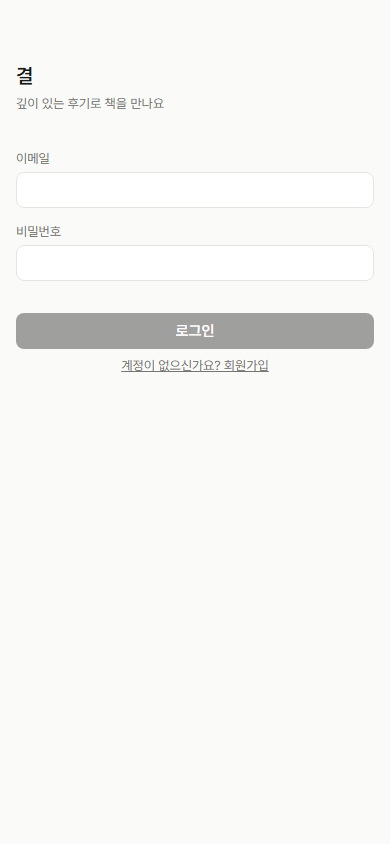</td>
<td width="33%">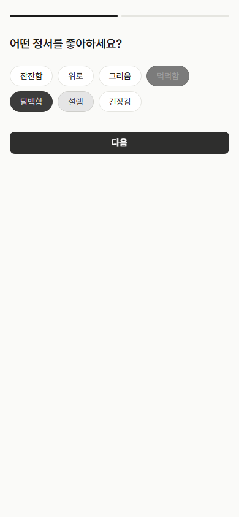</td>
<td width="33%">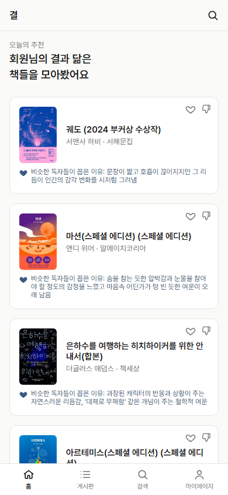</td>
</tr>
<tr>
<td align="center">로그인</td>
<td align="center">온보딩 · 취향 태그 선택</td>
<td align="center">홈 · 오늘의 추천</td>
</tr>
<tr>
<td width="33%">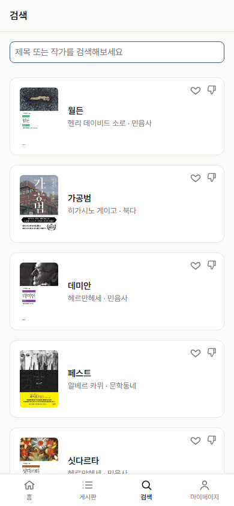</td>
<td width="33%">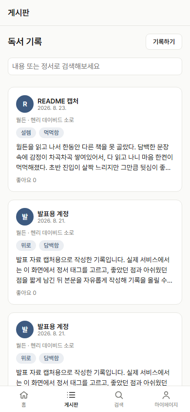</td>
<td width="33%">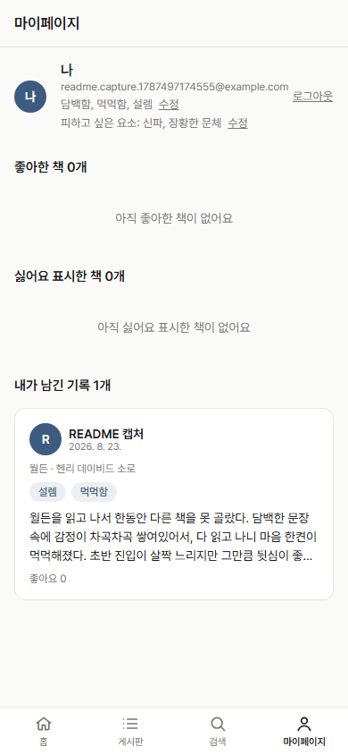</td>
</tr>
<tr>
<td align="center">검색</td>
<td align="center">게시판</td>
<td align="center">마이페이지</td>
</tr>
<tr>
<td width="33%">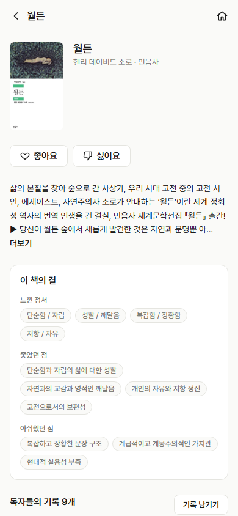</td>
<td width="33%">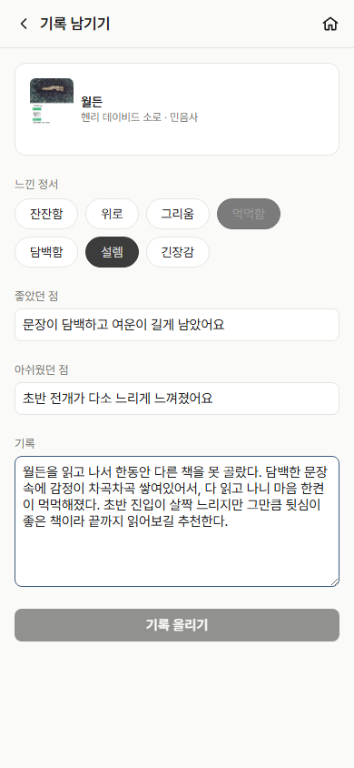</td>
<td width="33%">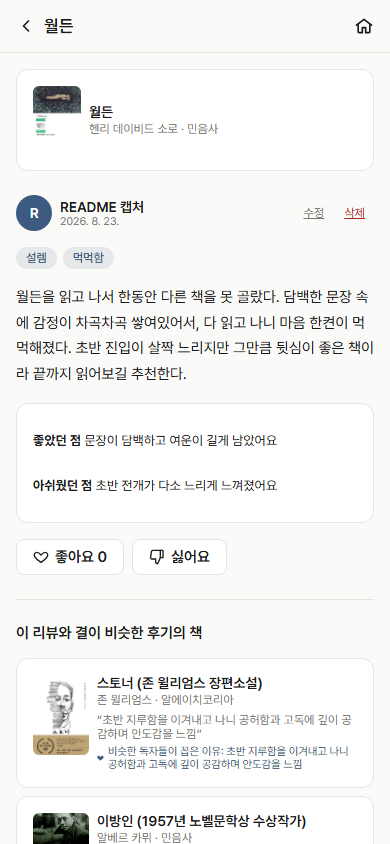</td>
</tr>
<tr>
<td align="center">도서 상세 · "이 책의 결"</td>
<td align="center">리뷰 작성</td>
<td align="center">리뷰 상세 · 결이 비슷한 책</td>
</tr>
</table>

## 시스템 아키텍처

백엔드는 명확한 3계층으로 나뉩니다 — 라우터는 HTTP 요청/응답만, 공유되는 비즈니스 로직은 `services`, DB 접근은 `models`가 맡습니다. 인증은 `Depends(get_current_user)`, DB 세션은 `Depends(get_db)`로 라우터마다 주입합니다. 추천 계산은 별도 FastAPI 프로세스인 ML 서버가 전담하고, 백엔드는 그 결과를 `books` 테이블과 조합해 응답합니다.

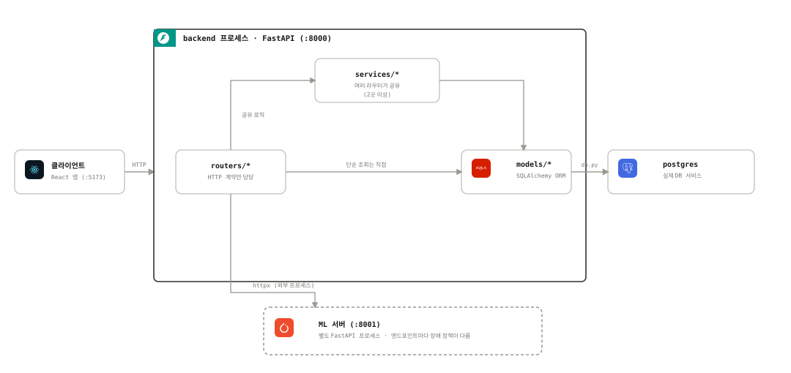

| 백엔드 호출부 | ML 엔드포인트 | 역할 | 장애 시 정책 |
|---|---|---|---|
| `PATCH /api/users/me/profile` | `POST /profile/build` | 유저 선호도 벡터화 및 캐싱 | 실패해도 프로필 저장 자체는 성공 처리 |
| `GET /api/recommendations` | `POST /recommend` | 홈 화면 "오늘의 추천" 매칭 | 홈 화면 주 콘텐츠라 실패를 숨기지 않고 에러 노출 |
| `GET /api/reviews/{id}/similar-books` | `POST /similar-books` | 리뷰 상세 "결이 비슷한 책" | 보조 섹션이라 빈 상태로 조용히 대체 |

## 프로젝트 전체 파이프라인

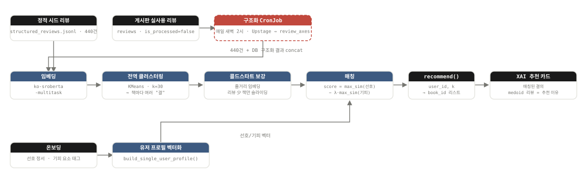

1. **임베딩** — 리뷰의 5축(정서_경험 / 좋았던_요소 / 별로였던_요소 / 소재_및_주제 / 독서_경험_맥락) 텍스트를 `jhgan/ko-sroberta-multitask`로 임베딩합니다.
2. **전역 클러스터링** — 책 구분 없이 전체 리뷰 임베딩을 KMeans(k=30)로 한 번에 클러스터링합니다. 리뷰마다 전역 "결" 하나가 배정되고, 책은 그 결들에 대한 (centroid, weight) 분포로 집계됩니다 — 책 하나 = 벡터 하나가 아니라 책 하나 = 여러 개의 결 벡터입니다.
3. **콜드스타트 보강** — 리뷰가 적은 책은 네이버 도서 소개(줄거리) 임베딩으로 결을 보강하고, 리뷰가 쌓일수록 그 비중을 자연스럽게 줄입니다(베이지안 스무딩).
4. **매칭** — 유저의 선호/기피 벡터와 책의 결 벡터들을 코사인 유사도로 비교해 `score = max_sim(선호) − λ·max_sim(기피)`로 점수를 매깁니다. 책 전체가 아니라 유저에게 가장 어필할 결 하나를 기준으로 판단합니다.
5. **XAI 추천 이유** — 점수 계산에 실제로 쓰인 결의 대표 리뷰(medoid)를 그대로 추천 이유로 노출합니다. 별도 요약 모델 없이 점수의 근거를 그대로 보여주므로 설명과 결과가 항상 일치합니다.
6. **실사용 리뷰 반영** — 게시판에 새 리뷰가 쌓이면(`reviews.is_processed = false`) 매일 새벽 2시 CronJob이 책 단위로 Upstage Solar API를 호출해 5축으로 구조화하고 `review_axes` 테이블에 저장합니다. 다음 카탈로그 재학습부터 이 리뷰들도 정적 시드(440건)와 함께 클러스터링에 포함됩니다.

### 데이터 파이프라인 (도서 선정 & 리뷰 생성)

| 단계 | 내용 |
|---|---|
| 1. 도서 선정 | 교보문고 '소설' 분류 베스트셀러 CSV 기준, 2025.7~2026.6 월간·주간 리스트를 중복 제거 후 병합 → 총 89권 중 서비스 성격과 맞지 않는 1건을 제외해 **88권** 확정 |
| 2. 메타데이터 구축 | 네이버 도서검색 API로 ISBN 기준 제목·저자·출판사·소개(description)를 일관된 형식으로 재구축 |
| 3. 평판 검색 | 팀원들이 책마다 Perplexity로 동일 프롬프트 검색 — 호/불호 이유, 평가 비율, 키워드, 실제 평론가 평가 수집 |
| 4. LLM 리뷰 생성 | Upstage Solar API로 책마다 6종 페르소나 중 선택해 리뷰 5건(호:불호:혼재 = 2:2:1) 생성 → **440건**. 700자 미만 등 기준 미달 시 재생성 |
| 5. 실제 리뷰 수집 | 구글폼으로 실제 독자에게 정성 리뷰 수집(7건) — 이후 게시판을 통해서도 지속 수집되며 CronJob으로 자동 구조화 |
| 6. 5축 구조화 | Upstage Solar API로 리뷰 원문을 정서_경험/좋았던_요소/별로였던_요소/소재_및_주제/독서_경험_맥락 5축으로 구조화(`structured_reviews.jsonl`) — 없는 축은 지어내지 않고 null 처리 |

## 기술 스택

### Frontend


> Tailwind, 라우팅/상태관리 라이브러리 없이 순수 CSS와 커스텀 훅으로 구성

### Backend


### AI / ML


> 임베딩 모델: `jhgan/ko-sroberta-multitask` · 클러스터링: KMeans(k=30)

### External APIs


> perplexity는 API 형태가 아닌 서비스 형태로 사용

### Infra & DevOps


> 배포: EC2 위 k3s(Traefik 인그레스) · 이미지 레지스트리: Docker Hub

### Collaboration


## 개발 환경

로컬에서는 DB·백엔드·ML 서버를 Docker Compose로, 프론트엔드는 Vite dev 서버로 따로 띄웁니다.

```bash
git clone <repo-url>
cd literec-system

# 1) DB + 백엔드(:8000) + ML 서버(:8001)
docker compose up -d db backend ml
# 헬스체크: http://localhost:8001/health 가 catalog_loaded=true 될 때까지 대기(모델 로드+임베딩+클러스터링)

# 2) 프론트엔드(:5173)
cd app
npm install
npm run dev
```

- `backend`, `ml`은 각각 `Python >= 3.12` + [uv](https://docs.astral.sh/uv/)로 의존성을 관리하며, 소스가 볼륨 마운트돼 있어 코드 수정이 바로 반영됩니다(백엔드는 `--reload`, ML은 재기동 필요).
- 백엔드 테스트: `cd backend && uv run pytest`(실제 Postgres에 `{db}_test` DB를 자동 생성해 사용, 외부 ML 호출만 `respx`로 모킹)
- ML 카탈로그 재학습을 로컬에서 강제로 트리거하려면 `POST /admin/rebuild-catalog`(헤더 `X-Admin-Secret`)를 호출합니다.

## 배포 환경

**배포 링크: http://literec-gyeol.duckdns.org**

단일 EC2 인스턴스 위에 경량 Kubernetes(k3s, Traefik 인그레스 내장)로 배포되어 있습니다.

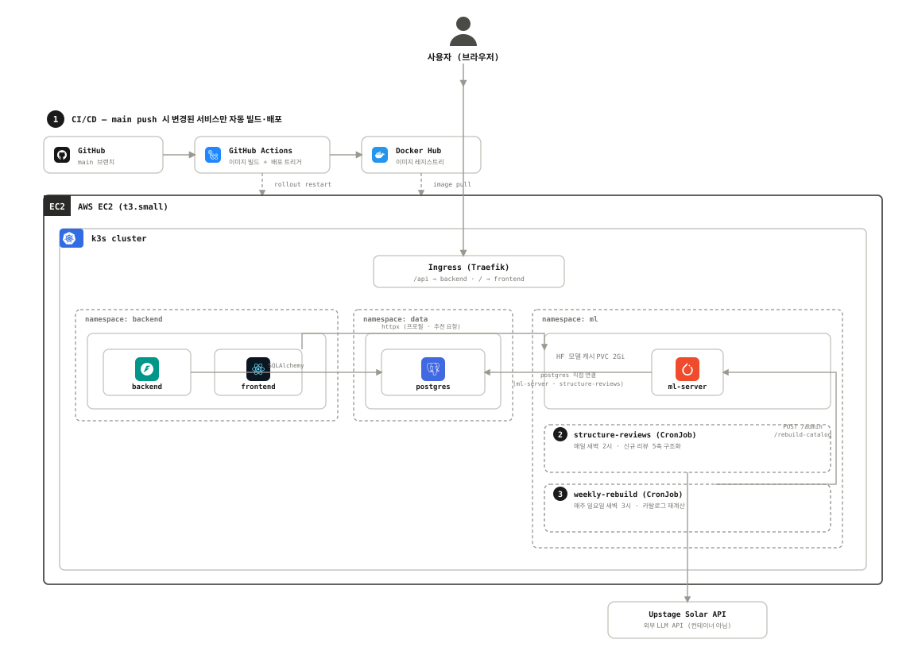

```
Ingress (Traefik)
 ├─ /api  → backend  Service (namespace: backend)
 └─ /     → frontend Service (namespace: backend)

namespace: data     — postgres (StatefulSet, PVC 5Gi)
namespace: backend  — backend, frontend (Deployment, replicas=1)
namespace: ml       — ml-server (Deployment, HF 모델 캐시 PVC 2Gi)
                       + structure-reviews (CronJob, 매일 새벽 2시)
                       + weekly-rebuild (CronJob, 매주 일요일 새벽 3시)
```

- **CI/CD**: `main` 브랜치 push 시 GitHub Actions가 변경된 경로(`backend/**`, `ML/**`, `app/**`)만 감지해 Docker 이미지를 빌드하고 Docker Hub(`j2nii/literec-{backend,frontend,ml}`)에 푸시한 뒤, `kubectl rollout restart`로 무중단 배포합니다.
- **시드 데이터**: 저장소 루트의 `data/`는 이미지에 포함되지 않아 EC2 노드 파일시스템(`hostPath`)에 별도로 올려두고, `seed-data` Job이 `alembic upgrade head` + `scripts/seed.py`를 실행합니다.
- **신규 리뷰 반영**: `structure-reviews` CronJob이 매일 새벽 2시 게시판에 쌓인 신규 리뷰를 Upstage로 구조화해 `review_axes`에 저장합니다.
- **카탈로그 재계산**: `weekly-rebuild` CronJob이 매주 일요일 새벽 3시 `POST /admin/rebuild-catalog`를 호출해, 그 주에 새로 구조화된 리뷰까지 포함해 클러스터링을 다시 계산하고 ML 서버 캐시를 갱신합니다.
- **모니터링**: Grafana 대시보드 구성.

## 평가 결과

추천이 실제로 개인 취향을 반영하는지, 팀원 4명이 88권 각각에 대해 "내 취향에 얼마나 맞는지(0~3점)"를 직접 평가한 라벨로 오프라인 검증했습니다(Recall@K, NDCG@K, relevance ≥ 2를 정답 기준으로 채택).

| model | NDCG@5 | NDCG@10 | NDCG@20 |
|---|---:|---:|---:|
| random(무작위 추천) | 0.373 | 0.401 | 0.415 |
| popularity(베스트셀러 순, 개인화 없음) | 0.271 | 0.372 | 0.460 |
| **aspect_based_model(결 기반 추천)** | **0.653** | **0.570** | **0.553** |

베스트셀러 순으로만 추천한 popularity baseline은 random과 뚜렷한 차이가 없었던 반면(NDCG@5 기준 오히려 낮음), 결 기반 모델은 실제로 읽어본 책 기준 popularity 대비 NDCG 약 5.6배, Recall 약 4.2배 높았습니다 — "그냥 인기 많은 책 추천"과 "개인 취향을 반영한 추천"의 차이가 뚜렷하게 확인됐습니다. 다만 팀원 4명 파일럿 데이터라 표본이 작아 통계적으로 확정적인 결론은 아니며, 실사용자 규모로 확장된 평가는 다음 단계로 계획되어 있습니다.

## 팀원 정보 및 역할 분담

| 이름 | GitHub | 역할 |
|---|---|---|
| 김유진 | [@daisykim0804](https://github.com/daisykim0804) | MLOps · 백엔드 |
| 김지은 | [@j2nii](https://github.com/j2nii) | 백엔드 · 인프라 |
| 신연주 | [@Yeondu428](https://github.com/Yeondu428) | ML · 성능 비교 |
| 이지원 | [@jwlee0348](https://github.com/jwlee0348) | 추천 알고리즘 |

---

<sub>Synapse 2기 여름프로젝트</sub>
