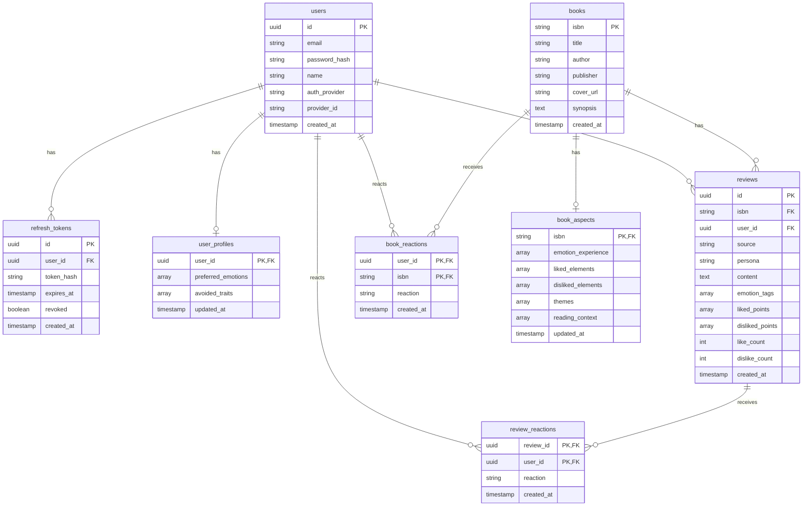

# LiteRec 백엔드 구현 요청 — Claude Code 작업 지시서

> 이 문서는 Claude Code에게 그대로 전달할 작업 브리프입니다.
> 현재 상태: React + Vite 프론트엔드는 목업 UI만 존재 (mock 데이터, 로그인/저장 로직 없음)
> 목표: FastAPI 백엔드 신규 구현 + 프론트 mock → 실제 API 연동
>
> ※ 오프라인 평가용 데이터셋/라벨링 기능은 이번 스코프에서 제외 (별도 구글폼으로 수집).
>   이 문서는 순수하게 **서비스 UI가 실제로 동작하기 위한 백엔드**만 다룹니다.

---

## 0. 컨텍스트 요약

- 레포: `literec-system` (모노레포, `app/` 프론트 + `backend/` FastAPI + `ML/`, `data/`)
- 프론트는 이미 `/hooks` 디렉토리에 `useBooks()`, `useBook(bookId)`, `useRecommendations()`, `useReviews(filter?)`, `useReviewsByBook(bookId)`, `useReview(reviewId)`, `useUserProfile()`, `useSimilarReviewBooks(reviewId)` 형태로 훅이 정의되어 있고, 모두 `{ data, isLoading, isError }`를 반환하도록 설계되어 있음 → **mock 데이터를 실제 fetch로 교체하는 구조로 설계되어 있으므로 훅 시그니처는 유지**
- 화면 목록: login, signup, onboarding(2 Step), home, bookDetail, board, reviewWrite, reviewDetail, search, mypage
- 추천 알고리즘 자체(임베딩/클러스터링/XAI)는 별도 ML 파트에서 별도 진행 중이므로 이번 스코프에서 제외. 추천 API는 **완전 랜덤 N권을 반환하는 더미**로만 연결

---

## 1. 이번 스프린트 스코프

### 포함 (Do)
1. 회원가입 / 로그인 / 로그아웃 (Access + Refresh Token)
2. 온보딩 데이터 저장 (선호 정서 7개 중 선택, 부담 요소 5개 중 선택)
3. 유저 프로필 CRUD (`useUserProfile()` 연동)
4. 도서 목록/상세 API (88권 시드 데이터 기반)
5. 게시판 리뷰 CRUD (작성/조회/좋아요·싫어요 반응, 별도 검증·모더레이션 없이 저장만)
6. 추천 API 더미 (랜덤 N권 반환)
7. PostgreSQL 스키마 및 마이그레이션
8. 로컬 개발 환경 (docker-compose로 FastAPI + Postgres 기동)

### 제외 (Don't — 이번 스코프 아님)
- 추천 알고리즘 실제 로직 (ML 파트 별도 진행)
- 벡터 임베딩/FAISS 연동
- 오프라인 평가용 라벨링 데이터 수집 (구글폼으로 별도 진행)
- K8s 매니페스트 배포 (인프라 담당자 별도 진행)
- CronJob (일/주 단위 재학습) 로직
- 소셜 로그인 (이메일/비밀번호만)
- 리뷰 콘텐츠 검증/모더레이션 (그냥 저장만, 필요 시 추후 추가)

---

## 2. 기술 스택 (기존 결정 준수)

- **Backend**: FastAPI, Python, `uv` 패키지 관리
- **DB**: PostgreSQL (SQLAlchemy + Alembic 마이그레이션 권장)
- **Auth**: JWT Access + Refresh Token 방식
  - Access token: 만료 15~30분, 요청마다 Authorization 헤더로 검증
  - Refresh token: 만료 1~2주, DB에 저장(로그아웃/탈취 시 무효화 가능하도록), httpOnly 쿠키 또는 별도 저장소 — 프론트 구현 방식에 맞춰 Claude Code가 제안하되 **보안상 localStorage에 refresh token 직접 저장은 지양**
  - Access token 만료 시 `/api/auth/refresh`로 재발급
- **비밀번호 해시**: bcrypt (passlib)
- **Data files**: `data/processed/books_naver.jsonl` (88건, 네이버 도서 API 메타 + `perplexity_review` 자유텍스트), `data/processed/llm_reviews.jsonl` (isbn 외래키, 페르소나 6종 중 5종을 책당 호 2/불호 2/혼재 1 비율로 사용 → 88권 × 5건 = 총 440건) — 이 두 파일을 초기 시드 데이터로 DB에 적재. 필드 매핑/파싱 규칙은 섹션 6 참고

---

## 3. DB 스키마 초안

```
users
- id (uuid, pk)
- email (unique, nullable)          -- 카카오 로그인 시 이메일 미동의 가능성 있어 nullable
- password_hash (nullable)          -- 카카오 전용 유저는 null (비밀번호 없음)
- name
- auth_provider (enum: 'local' | 'kakao', default 'local')
- provider_id (text, nullable)      -- 카카오가 발급하는 고유 유저 ID
- created_at
-- (auth_provider, provider_id) unique 조합으로 동일 카카오 계정 중복 가입 방지

refresh_tokens
- id (uuid, pk)
- user_id (fk → users.id)
- token_hash            -- 원문 저장 금지, 해시로 저장
- expires_at
- revoked (boolean, default false)
- created_at

user_profiles
- user_id (fk → users.id, unique)
- preferred_emotions (text[])   -- 온보딩 Step1, 7개 중 선택
- avoided_traits (text[])       -- 온보딩 Step2, 5개 중 선택
- updated_at

books
- isbn (pk)
- title
- author
- publisher
- cover_url          -- 네이버 도서 API 값
- synopsis
- created_at

book_aspects            -- LLM이 리뷰에서 추출한 5개 축 구조화 데이터 (책 단위 대표값, IdentityRadarChart용)
- isbn (fk → books.isbn)
- emotion_experience (text[])   -- 정서_경험
- liked_elements (text[])       -- 좋았던_요소
- disliked_elements (text[])    -- 별로였던_요소
- themes (text[])               -- 소재_및_주제
- reading_context (text[])      -- 독서_경험_맥락
- updated_at

reviews
- id (uuid, pk)
- isbn (fk → books.isbn)
- user_id (fk → users.id, nullable)  -- LLM 생성 리뷰는 null, 실사용자는 user_id 존재
- source (enum: 'llm_generated' | 'user')
- persona (text, nullable)      -- LLM 생성 리뷰인 경우만
- content (text)
- emotion_tags (text[])
- liked_points (text[])
- disliked_points (text[])
- like_count (int, default 0)
- dislike_count (int, default 0)
- created_at

review_reactions         -- 리뷰에 대한 좋아요/싫어요 (UI 목업 기준: 좋아요/싫어요 버튼 둘 다 존재)
- review_id (fk)
- user_id (fk)
- reaction (enum: 'like' | 'dislike')
- created_at
- (review_id, user_id) unique   -- 한 유저당 리뷰 하나에 반응 하나만 (좋아요/싫어요 상호 배타)

book_reactions           -- 책 자체에 대한 좋아요/싫어요 (리뷰 작성과 별개, mypage "좋아한 책" ❤️ 및 신규 👎 버튼)
- user_id (fk → users.id)
- isbn (fk → books.isbn)
- reaction (enum: 'like' | 'dislike')
- created_at
- (user_id, isbn) unique   -- 한 유저당 책 하나에 반응 하나만 (좋아요/싫어요 상호 배타)
```



---

## 4. API 엔드포인트 초안

### 4.1 인증
```
POST   /api/auth/signup         { email, password, name } → 201
POST   /api/auth/login          { email, password } → { access_token, refresh_token, user }
POST   /api/auth/refresh        { refresh_token } → { access_token }
POST   /api/auth/logout         (Bearer token) → refresh_token revoke 처리
GET    /api/auth/me             (Bearer token) → 현재 유저 정보

POST   /api/auth/kakao/callback { code } → 카카오 인가 코드 받아 토큰 교환 → 유저 조회/신규생성 → 우리 서비스 Access/Refresh Token 발급
                                  ⚠️ 로그인 이후 흐름(JWT 발급/갱신)은 이메일 로그인과 동일 로직 재사용
```
- 이메일 형식 검증, 중복 이메일 체크는 백엔드에서도 최소한 처리 (프론트 검증과 별개로)
- 카카오 로그인 유저는 `auth_provider='kakao'`로 저장, `password_hash`는 null

### 4.2 온보딩 / 프로필
```
GET    /api/users/me/profile    → UserProfile (useUserProfile() 연동)
PATCH  /api/users/me/profile    { preferredEmotions[], avoidedTraits[] } (부분 허용) → user_profiles upsert
```
- ⚠️ **온보딩 전용 `POST /api/onboarding`은 별도로 만들지 않는다**: 프론트는 `OnboardingPage`도 `MyPage`(취향 재설정)도 똑같이 `useUserProfile().updateProfile(partial)` 하나만 호출하고, 훅 레벨에서는 "최초 온보딩인지 이후 수정인지" 구분할 방법이 없다. 따라서 `updateProfile`은 항상 `PATCH /api/users/me/profile` 하나로만 연결하고, 이 엔드포인트가 `user_profiles` 행이 없으면 생성(upsert)까지 처리해야 한다.

### 4.3 도서
```
GET    /api/books               → 88권 리스트 (useBooks())
GET    /api/books/{isbn}        → 상세 (useBook, book_aspects 포함하여 IdentityRadarChart 데이터 제공)
```
- ⚠️ **`GET /api/books/search?q=...`는 만들 필요 없음**: `useBooks()`는 파라미터 없이 전체 목록만 반환하는 훅이고(5.2), `SearchPage`는 이 전체 목록을 받아 제목/작가로 클라이언트에서 필터링한다(88권 규모라 서버 검색 없이도 충분). 이전 버전 브리프의 이 엔드포인트는 실제 훅 시그니처와 맞지 않는 계획이었으므로 제거.

### 4.4 리뷰 / 게시판
```
GET    /api/reviews?filter=...        → useReviews(filter?)  (board 목록)
GET    /api/books/{isbn}/reviews      → useReviewsByBook(bookId)
GET    /api/reviews/{id}              → useReview(reviewId)
POST   /api/reviews                   { isbn, content, emotion[], liked[], disliked[] } → 유저 작성 리뷰, 검증 없이 저장
POST   /api/reviews/{id}/reaction     { reaction: 'like' | 'dislike' } → review_reactions upsert (상호 배타)
DELETE /api/reviews/{id}/reaction     → 반응 취소
GET    /api/users/me/review-reactions → { [reviewId]: 'like' | 'dislike' } 형태로 현재 유저의 전체 리뷰 반응 반환
```
- ⚠️ 기존 `POST /api/reviews/{id}/like` 대신 위 방식으로 통일 (UI 목업에 좋아요/싫어요 버튼 둘 다 존재하므로 book_reactions와 동일 패턴 사용)
- ⚠️ **`GET /api/users/me/review-reactions` 신규 추가 필요**: 프론트의 `useReviewReaction(reviewId)` 훅은 로그인 유저가 이 리뷰에 이미 남긴 반응("내 반응")을 화면 진입 시 즉시 알아야 좋아요/싫어요 버튼의 초기 활성 상태를 그릴 수 있는데, 기존 API 목록엔 이걸 조회하는 방법이 없었다. `Review` 타입(5.1) 자체에는 `myReaction` 같은 필드를 넣지 않고(스펙 100% 유지), 대신 `book_reactions`의 `GET /api/users/me/liked-books`와 동일한 패턴으로 별도 조회 엔드포인트를 둔다.
- ⚠️ **필드명 매핑 (직렬화 규칙)**: `UI_DESIGN_SPEC.md` 5.1의 훅 반환 타입은 DB 컬럼명과 이름이 다르다. API 응답을 만들 때 아래처럼 변환해서 내려줄 것 (CLAUDE.md가 프론트 반환 타입 100% 유지를 요구하므로, 변환은 항상 백엔드 응답 직렬화 단에서 처리):
  - `emotion_tags` (DB) → `emotion` (응답)
  - `liked_points` (DB) → `liked` (응답)
  - `disliked_points` (DB) → `disliked` (응답)
  - `books.isbn` → `Book.id` (프론트는 별도 book id 개념이 없고 isbn 값을 그대로 `id`로 사용)

### 4.4.1 책 자체 반응 (좋아요/싫어요) — 신규
```
POST   /api/books/{isbn}/reaction     { reaction: 'like' | 'dislike' } → book_reactions upsert
                                       ⚠️ 리뷰 작성과 무관하게 독립적으로 남길 수 있는 반응
                                       ⚠️ 이미 반대 반응이 있으면 덮어씀 (좋아요↔싫어요 상호 배타)
DELETE /api/books/{isbn}/reaction     → 반응 취소 (중립 상태로)
GET    /api/users/me/book-reactions   → { likedBookIds: string[], dislikedBookIds: string[] } (useUserProfile()이 이 응답으로 두 배열을 채움)
```
- ⚠️ **`GET /api/users/me/liked-books` 대신 위 `book-reactions` 형태로 통일**: `useUserProfile()` 훅이 `data.likedBookIds`(5.1 `UserProfile` 타입 그대로)와, 타입 외부의 추가 반환값 `dislikedBookIds`를 함께 내려주도록 구현돼 있어(마이페이지 "싫어요 표시한 책" 섹션용), 좋아요/싫어요를 한 번의 호출로 같이 받는 편이 프론트 훅 구조와 맞다. `dislikedBookIds`는 `UserProfile` 타입(5.1)에는 포함하지 않는다(스펙 100% 유지 — 마이페이지에 "싫어한 책" 리스트가 있을 뿐, 프로필 자체의 필드는 아님).
- UI: 좋아요(❤️)/싫어요(👎) 버튼은 bookDetail뿐 아니라 홈/검색/마이페이지/마이페이지 전체보기의 `BookCard` 전체에 공용으로 존재(상호 배타 토글). 찜하기(북마크)는 이번 스코프에서 별도 구현하지 않음
- ⚠️ **마이페이지 "전체 보기" 화면(좋아한 책/싫어요 표시한 책/내가 남긴 기록)은 별도 페이지네이션·신규 엔드포인트가 필요 없다.** 기존 `GET /api/books` + `GET /api/users/me/book-reactions`, `GET /api/reviews` + 로그인 유저 id로 클라이언트에서 필터링하는 지금 구조를 그대로 쓰면 된다(마이페이지에서는 이 중 앞쪽 3개만 미리보기로 자름).

### 4.5 추천 (더미)
```
GET    /api/recommendations           → useRecommendations()
                                         ⚠️ 완전 랜덤 N권 반환 (N=쿼리파라미터, 기본 10)
                                         ⚠️ ML 파트 연동 시 교체 예정임을 코드 주석에 명시
GET    /api/reviews/{id}/similar-books → useSimilarReviewBooks(reviewId)
                                         ⚠️ 동일하게 랜덤 더미
```

---

## 5. 프론트 연동 가이드

- 기존 `/hooks` 파일들은 목업 데이터를 반환하는 구조로 되어 있을 것 → 내부 구현만 실제 fetch로 교체, **훅의 반환 타입(`{ data, isLoading, isError }`)과 시그니처는 그대로 유지**해서 화면 컴포넌트 쪽 수정 최소화
- Access token: 메모리 또는 상태 관리 라이브러리에 저장, API 요청 시 Authorization 헤더 자동 첨부하는 공통 fetch wrapper 작성
- Refresh token: httpOnly 쿠키 권장 (프론트에서 직접 접근 불필요, 자동 전송) — 쿠키 방식이 부담되면 최소한 localStorage 대신 메모리+재로그인 유도 방식 검토
- Access token 만료로 401 응답 시, 공통 wrapper에서 자동으로 `/api/auth/refresh` 호출 후 원래 요청 재시도하는 인터셉터 패턴 구현
- ⚠️ **`constants/user.ts`의 `CURRENT_USER_ID = 'user_me'` 하드코딩 제거 필요**: `useCreateReview`(새 리뷰의 `userId`), `MyPage`/`MyListPage`("내가 남긴 기록" 필터링)가 전부 이 목업 상수를 직접 참조한다. 실제 로그인 연동 시 `/api/auth/me` 응답(또는 JWT 디코딩)에서 얻은 실제 유저 id로 교체해야 하며, 이 세 곳 전부를 빠짐없이 고쳐야 함.

---

## 6. 시드 데이터 적재

### 6.1 `books_naver.jsonl` (88건) → `books` + `book_aspects`

`books` 테이블 필드 매핑:

| jsonl 필드 | DB 컬럼 |
|---|---|
| `isbn` | `isbn` |
| `title` | `title` |
| `author` | `author` |
| `publisher` | `publisher` |
| `image` | `cover_url` |
| `description` | `synopsis` |
| `product_id` | 저장 안 함 (시드 스크립트 내부 매칭용으로만 사용, DB 컬럼 없음) |

`book_aspects`는 별도 컬럼이 아니라 `perplexity_review`(자유 텍스트) 한 필드에서 파싱해서 채운다. 이 필드는 88건 모두 아래와 동일한 5개 섹션 구조를 갖는 것으로 확인됨:

1. "이 책을 좋아한 독자들이 주로 언급한 이유" → `liked_elements`
2. "이 책을 별로라고 한 독자들이 주로 언급한 이유" → `disliked_elements`
3. "최근 2년 이내 독자 반응에서 호/불호/혼재의 근거와 비율" → (대응하는 축 없음, 파싱 안 함)
4. "자주 언급되는 정서 키워드" → `emotion_experience`
5. "평론/수상 등 외부 평가가 독자 반응에 영향을 미쳤다면 한 줄 요약" → (대응하는 축 없음, 파싱 안 함)

⚠️ `themes`(소재_및_주제), `reading_context`(독서_경험_맥락) 두 축은 `perplexity_review`의 5개 섹션 중 직접 대응하는 항목이 없다. `description`(시놉시스)에서 키워드를 뽑아 채우거나, 우선 빈 배열로 시작해도 무방하다(`IdentityRadarChart`는 5개 축 중 값이 있는 축만 그려도 정상 동작).

⚠️ `identityVectors`(`trait`/`score`) 변환 관련 미해결 항목은 **섹션 9. 추후 과제** 참고 — `GET /api/books/{isbn}` 구현 전 확인 필요.

### 6.2 `llm_reviews.jsonl` (88권 × 5건 = 440건) → `reviews`

`reviews` 테이블 필드 매핑:

| jsonl 필드 | DB 컬럼 |
|---|---|
| `isbn` | `isbn` (fk) |
| `persona` | `persona` |
| `content` | `content` |
| (고정값) | `source = 'llm_generated'`, `user_id = null` |
| (고정값) | `like_count = 0`, `dislike_count = 0` |
| `sentiment`(호\|불호\|혼재) | 저장 안 함 — `emotion_tags`/`liked_points`/`disliked_points` 중 어디에도 직접 대응하지 않으므로, 이 세 컬럼은 LLM 시드 리뷰에 한해 빈 배열(`[]`)로 시작한다(자유 텍스트 리뷰라 문장 단위 태그 추출 로직은 이번 스코프에서 만들지 않음) |
| `book_title`, `review_index`, `persona_reason` | 저장 안 함 (리뷰 생성 파이프라인 검증용 메타데이터) |

마이그레이션/시드용 1회성 스크립트는 `backend/scripts/seed.py` 형태로 분리, 반복 실행해도 중복 적재되지 않도록 upsert 처리.

---

## 7. 작업 순서 제안 (Claude Code에게)

1. `backend/` 프로젝트 구조 설정 (FastAPI + uv + SQLAlchemy + Alembic)
2. DB 스키마 (섹션 3) → Alembic 마이그레이션 작성
3. 인증 (signup/login/refresh/logout) 구현 + 테스트
4. 온보딩/프로필 API 구현
5. 도서 시드 데이터 적재 스크립트 + 도서 GET API들
6. 리뷰 CRUD API 구현
7. 추천 API 더미(랜덤) 구현
8. 프론트 훅 실제 API 연동 (mock 제거, 공통 fetch wrapper + 토큰 갱신 인터셉터 포함)
9. docker-compose로 로컬 통합 테스트 (FastAPI + Postgres)

---

## 8. 결정된 사항 요약 (Claude Code가 임의로 되돌리지 않도록 명시)

| 항목 | 결정 |
|---|---|
| 추천 API 더미 로직 | 완전 랜덤 N권 (온보딩/태그 매칭 등 로직 없음, ML 파트 완성 전까지 임시) |
| 로그인 세션 | Access + Refresh Token, access 15~30분 / refresh 1~2주, refresh는 DB에 저장해 무효화 가능하도록 |
| 리뷰 작성 검증 | 별도 금칙어/길이 검증 없이 그냥 저장 (추후 필요 시 추가) |
| 오프라인 평가 데이터 | 이번 백엔드 스코프에서 완전히 제외, 별도 구글폼으로 수집 |
| 카카오 로그인 | `users` 테이블에 `auth_provider`/`provider_id` 필드로 확장 (옵션 A, 별도 oauth_accounts 테이블 아님). 지금 당장 카카오 로그인 기능 자체를 구현하진 않지만, 스키마는 미리 확장 가능하게 반영 |
| 책 자체 좋아요/싫어요 | 리뷰 반응(`review_reactions`)과 별개로 `book_reactions` 테이블 신규. UI는 기존 ❤️(좋아요) 유지 + 👎(싫어요) 아이콘 추가, 상호 배타적 토글. 찜하기(북마크)는 이번 스코프 제외. 오프라인 평가(별도 팀원 이슈)의 positive/negative 신호로 활용 예정 |
| 리뷰 좋아요/싫어요 | UI 목업(reviewDetail)에 좋아요/싫어요 버튼 둘 다 존재 확인됨 → `review_likes`를 `review_reactions`(reaction: like\|dislike)로 확장, book_reactions와 동일 패턴으로 통일. `reviews.dislike_count` 필드 추가 |
| 마이페이지 목록 조회 | 좋아한 책/싫어요 표시한 책/내가 남긴 기록 3개 섹션 모두 기존 목록 API(`GET /api/books`, `GET /api/reviews`) + 반응 조회 API(`GET /api/users/me/book-reactions`, 로그인 유저 id)의 클라이언트 필터링만으로 충분. "전체 보기" 화면도 동일 데이터에서 개수 제한만 없앤 것이라 신규 엔드포인트 불필요 |
| 리뷰 반응 초기 상태 조회 | `useReviewReaction(reviewId)`가 화면 진입 시 "내 반응"을 알아야 하므로 `GET /api/users/me/review-reactions`를 신규 추가(`book_reactions`의 `liked-books`와 동일 패턴). `Review` 타입(5.1)엔 반응 필드를 넣지 않음 |
| `CURRENT_USER_ID` 목업 상수 | `useCreateReview`, `MyPage`, `MyListPage` 3곳에서 참조 중 → 로그인 연동 시 실제 인증 유저 id로 전부 교체 필요 |

---

## 9. 추후 과제 (미해결 항목, 기록만 해두고 지금 당장 해결하지 않음)

### 9.1 `book_aspects` → `Book.identityVectors`(`trait`/`score`) 매핑 규칙

- **현상**: `Book.identityVectors`(5.1)는 `{ trait, score, keywords }[]` 형태이고, `trait`는 프론트 `RADAR_TRAITS`(`잔잔함, 몰입감, 서정성, 현실성, 여운`) 5개 고정값을 쓴다. 반면 `book_aspects`(섹션 3) 컬럼명은 `emotion_experience`/`liked_elements`/`disliked_elements`/`themes`/`reading_context`로, 이 5개 trait와 이름·의미가 1:1로 대응하지 않는다.
- **해야 할 일**: `GET /api/books/{isbn}` 응답을 만들 때 (1) `book_aspects` 5개 컬럼 → `RADAR_TRAITS` 5개 trait로 매핑하는 규칙, (2) 각 trait의 `score`(숫자, `IdentityRadarChart` 폴리곤 계산용)를 무엇으로 산출할지(예: 컬럼별 키워드 개수 환산, 별도 LLM 채점 등)를 정해야 함.
- **상태(2026-08-19 갱신)**: `trait`/`score` 매핑(스코어링)은 여전히 미확정 — `identityVectors`는 계속 빈 배열로 반환하고, `RadarChart`는 값이 채워지기 전까지 렌더링하지 않는다. 대신 스코어링 없이 `book_aspects` 원본 축 텍스트(`emotion_experience`/`liked_elements`/`disliked_elements`)를 `BookOut.aspects`로 그대로 노출하고, 책 상세 "이 책의 결" 카드가 이를 라벨+태그로 표시하도록 함(`UI_DESIGN_SPEC.md` 5.1/6.5 갱신). `themes`/`reading_context`는 `seed.py`의 `parse_book_aspects()`가 항상 빈 배열로 채우고 있어 노출 대상에서 제외. trait/score 스코어링 자체는 여전히 별도 논의/확정 필요.