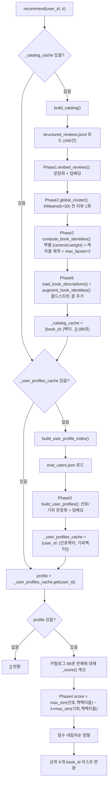

# 추천 로직 정리 — 설계 vs 구현, 그리고 추론 파이프라인

- 기준 문서: `ML/pipeline/DESIGN.md`
- 실 데이터 규모: 리뷰 440건 (`data/processed/structured_reviews.jsonl`), 책 88권 (`data/processed/books_naver.jsonl`)
- 최종 인터페이스: `ML/pipeline/aspect_based_model.py`의 `recommend(user_id: str, k: int = 10) -> list[str]`

이 문서는 DESIGN.md가 제시한 설계와, 실제 `ML/pipeline/*.py` 코드가 그 설계를 어떻게 구현했는지를 Phase별로 대조하고, 마지막에 `recommend()` 한 번 호출이 실제로 거치는 추론 파이프라인을 정리한다.

---

## 1. 핵심 아이디어

별점 대신 장문 리뷰를 **5축**(정서_경험 / 좋았던_요소 / 별로였던_요소 / 소재_및_주제 / 독서_경험_맥락)으로 구조화하고, 책 하나를 "단일 벡터"가 아니라 **여러 개의 결(facet) 벡터 리스트**로 표현한다. 같은 책도 "문체가 좋아서" 좋아하는 독자와 "위로받아서" 좋아하는 독자의 근거를 하나로 평균 내지 않고 그대로 보존한 뒤, 유저의 선호/기피 벡터와 **max-similarity**로 매칭한다.

결(facet)의 종류는 책 하나만 보고 정하지 않고, **전체 리뷰(440건)를 한 번에 클러스터링**해서 전 책 공통 기준으로 정의한다. 이렇게 해야 A책의 "문체 결"과 B책의 "문체 결"이 실제로 같은 벡터 공간을 가리키게 된다.

---

## 2. Phase별 설계 → 구현 대조

### Phase 0 — Mock 데이터
설계대로 `ML/pipeline/mock_data/reviews.json`에 책 5권 × 리뷰 5개(호2/불호2/혼재1) 구성. Phase 1~6 단위 데모/검증용으로만 쓰이고, 최종 `recommend()`는 실 데이터(`structured_reviews.jsonl`)를 쓴다.

### Phase 1 — 임베딩 (`embedding.py`)
- `to_sentence(review)`: 5축 중 값이 있는 필드만 `"{라벨}: {값}."` 형태로 이어붙인 문장 생성. 설계 규칙대로 책 메타데이터(제목/작가/출판사)는 **제외** — 같은 책의 리뷰끼리 값이 동일해 클러스터를 가르는 신호가 못 되고 노이즈만 늘리기 때문.
- `embed(texts)`: `jhgan/ko-sroberta-multitask`로 `normalize_embeddings=True` 임베딩. 정규화된 벡터라 이후 모든 코사인 유사도 계산이 **내적(dot product)만으로** 처리된다 — Phase 2/4/5/6 전체가 이 전제 위에서 동작.
- 설계와 100% 일치. 추가 구현: `save_embeddings`/`load_embeddings`로 Phase 2가 재사용할 수 있게 압축 캐싱.

### Phase 2 — 글로벌 클러스터링 (`clustering.py`)
설계는 원래 HDBSCAN을 상정했으나, 구현 단계에서 **KMeans(n_clusters=30, 팀 확정)로 전환**했다. 근거는 `experiment_hdbscan_vs_kmeans.py`:

| 방법 | 실 데이터(440건)에서의 문제 |
|---|---|
| HDBSCAN | 파라미터를 어떻게 조합해도 "리뷰의 90%가 노이즈로 버려짐" 또는 "거대 클러스터 하나로 뭉침" 둘 중 하나만 반복 |
| KMeans(k=30) | 클러스터 크기 고름, 다수 책에 걸침, 클러스터별 호/불호 비율도 뚜렷이 갈림 |

책 단위 후처리는 설계 "방식 1"(평균 내지 않음) 그대로 구현:
1. 책마다 리뷰가 어느 전역 클러스터에 몇 개 속하는지 집계
2. `weight = 그 클러스터의 이 책 리뷰 수 / 이 책 전체 리뷰 수`
3. **캐치올 클러스터 제외** (`coverage_threshold=0.3`): 전체 책의 30% 이상이 걸쳐 있는 클러스터는 매칭 후보에서 뺀다. 단, 이 제외로 그 책의 결이 전부 사라지면(orphaned) 예외적으로 제외를 되돌린다.
4. **`max_facets=2` 캡**: weight 상위 2개만 남김. "결이 많은 책일수록 유리해지는" 구조적 편향을 실험으로 확인(무작위 유저 벡터 기준 결 개수-점수 상관계수 0.70 → cap=2에서 0.05) 후 보정.
5. 벡터를 가중 평균하지 않고 `(centroid, weight)` 쌍 리스트를 그대로 `BookIdentity.cluster_vectors`/`cluster_weights`로 보존.

`min_weight` 파라미터는 존재하지만 기본값 0.0(미적용) — 책당 리뷰가 정확히 5개뿐이라 weight가 0.2 단위로만 나뉘어, 지금 켜면 결 1개짜리 책이 0개(orphaned)가 될 위험 때문에 보류 중.

### Phase 2.5 — 책 카드 생성 (`xai.py`)
설계대로 Phase 5(XAI)와 "클러스터에서 대표 뽑기" 로직을 공유(`describe_facet`). 대표 선정 방식은 설계에 없던 세부 결정: **medoid 방식** — 클러스터 centroid와 코사인 유사도가 가장 높은 이 책의 실제 리뷰 하나를 골라 그 리뷰의 5축 텍스트를 그대로 카드에 노출. 형태소 분석 기반 키워드 추출은 하지 않음(한국어 교착어 특성상 조사가 붙은 채 잘려 품질 저하 우려).

### Phase 3 — 유저 취향 프로필 (`user_profile.py`)
- 온보딩 `preferredEmotions`/`avoidedTraits`를 각각 문장으로 변환 후 임베딩 → **선호 벡터, 기피 벡터** 2개 생성, 생성 후 고정(설계 그대로, 실시간 갱신 없음).
- 설계에 없던 엣지케이스 처리: `avoidedTraits`를 0개 선택해도 온보딩 완료가 가능하므로, 비어 있으면 기피 벡터를 **영벡터**로 둔다. Phase 4의 페널티 항이 자연히 0이 되어 "기피 없음"이 별도 분기 없이 표현됨.
- 실 데이터 소스는 팀원 4명이 구글폼으로 응답한 `ML/eval/eval_data/eval_users.json`.

### Phase 4 — 매칭 (`matching.py`)
설계 공식 그대로 구현:
```
score = max_sim(선호벡터, 책벡터들) − λ × max_sim(기피벡터, 책벡터들)
```
- `cosine_max_sim`: 후보 벡터가 없거나 유저 벡터가 영벡터면 0.0 반환(정규화된 벡터라 내적=코사인).
- `rank_books`가 전체 책 점수를 내림차순 정렬해 Top-K `(book_id, score)` 반환.
- **λ=0.5는 설계 문서 작성 시점엔 "가정값"이었으나, 이후 `ML/eval/tune_lambda.py`로 팀원 4명 pilot 데이터 기준 λ ∈ {0, 0.25, 0.5, 0.75, 1.0, 1.5, 2.0} 그리드서치를 거쳐 검증 완료.** λ=0(기피 미반영)과 λ=2.0(과도한 페널티) 양쪽에서 NDCG가 뚜렷이 낮아지고, λ=0.5~0.75 구간이 최선(NDCG@10: 0.5=0.557, 0.75=0.562로 근소한 차이) → 0.5 유지. n=4명 pilot이라 "확정값"이 아니라 "임의로 고른 값이 아니라는 근거" 정도로 취급.
- 이 모듈은 `BookIdentity`가 어떤 클러스터링 알고리즘 산출물인지 몰라도 동작하도록 설계됨(`book.vectors()` 리스트만 소비) — Phase 2가 HDBSCAN에서 KMeans로 바뀌었을 때도 `matching.py`는 수정이 필요 없었다.

### Phase 5 — XAI 설명 (`xai.py`)
- `matching.py`를 건드리지 않고 구현: `best_matching_facet_label()`이 `BookIdentity.cluster_vectors` 딕셔너리에서 유저 벡터와 가장 유사한 label을 **다시 계산**해서 "어떤 결이 선택됐는지"를 얻는다. Phase 4가 별도로 클러스터 정보를 반환하도록 확장할 필요가 없었음.
- `format_reason()`: 대표 리뷰의 5축 중 `좋았던_요소` → `정서_경험` → `소재_및_주제` → `독서_경험_맥락` 순으로 하나만 골라 "비슷한 독자들이 꼽은 이유: …" 문구 생성. `별로였던_요소`는 추천 이유로 쓰지 않음.
- 다만 `explain_recommendation()`은 Phase 2 산출물(`cluster_vectors`)만 보고, Phase 6이 덧붙이는 콜드스타트 벡터가 최댓값으로 선택된 경우는 다루지 않는다(별도 처리 필요, 현재 미구현).

### Phase 6 — 콜드스타트 (`coldstart.py`)
설계의 "베이지안 스무딩"(미정이던 부분)을 **empirical-Bayes shrinkage**로 구체화:
```
weight = k / (k + review_count)   (k = DEFAULT_REVIEW_THRESHOLD = 5)
```
review_count=0 → weight=1.0(순수 줄거리 기반), review_count=k → weight=0.5, 리뷰가 많아질수록 0에 점근.

구현 트릭: 콜드스타트 벡터를 **단위 벡터가 아니라 weight만큼 줄어든 벡터**로 만들어 책의 기존 결 벡터 리스트에 원소 하나로 추가. `cosine_max_sim`의 내적 계산이 이 벡터에 대해서만 자동으로 weight가 곱해진 유사도가 되므로, `matching.py`/`BookIdentity` 구조를 전혀 바꾸지 않고 슬라이딩이 적용된다.

줄거리 소스는 `books_naver.jsonl`의 `description` (같은 파일의 `perplexity_review`는 리뷰 생성에 참고 소스로 이미 쓰여 순환참조 위험이 있어 제외). `book_id`는 파이프라인 전체에서 `isbn`을 그대로 쓴다.

---

## 3. `recommend()` 추론 파이프라인 (`aspect_based_model.py`)

`recommend(user_id, k=10)` 한 번 호출이 실제로 거치는 흐름:



### 3.1 캐싱 전략
`_catalog_cache`(카탈로그: 임베딩→클러스터링→콜드스타트 결합 결과)와 `_user_profiles_cache`(유저 프로필)는 **모듈 전역에 프로세스당 한 번만** 계산한다. `evaluate_model()`이 유저마다 `recommend()`를 반복 호출하기 때문에, 무거운 연산(리뷰 임베딩 440건, KMeans, 콜드스타트 임베딩 88권)을 유저 수만큼 반복하지 않도록 하는 설계. `recommend()` 호출마다 실제로 하는 일은 "이미 계산된 카탈로그에서 이 유저 벡터와 매칭 점수 계산"뿐이다.

### 3.2 한 번의 호출에서 실제로 도는 것
1. **(최초 1회만)** 카탈로그 빌드: 리뷰 440건 → 문장 변환 → 임베딩 → KMeans(k=30) 글로벌 클러스터링 → 책 88권 각각 `(centroid, weight)` 결 리스트로 집계(캐치올 제외 + max_facets=2 캡) → 콜드스타트 결 벡터 추가
2. **(최초 1회만)** 유저 프로필 빌드: `eval_users.json`의 모든 유저를 배치로 선호/기피 벡터화
3. **(매 호출)** 요청받은 `user_id`의 프로필을 캐시에서 조회 (없으면 빈 리스트 반환)
4. **(매 호출)** 카탈로그의 책 88권 전부에 대해 `score = max_sim(선호, 책 벡터들) − 0.5 × max_sim(기피, 책 벡터들)` 계산
5. **(매 호출)** 점수 내림차순 정렬 후 상위 K개 `book_id`만 반환

XAI 설명(Phase 5, `explain_recommendation`)은 `recommend()` 반환값에는 포함되지 않는다 — `xai.py`가 별도로 유저 벡터·`BookIdentity`·클러스터 결과를 받아 "왜 이 책인지" 문구를 만드는 **보조 경로**이며, `recommend()`의 인터페이스(`list[str]`)는 `ML/eval/evaluation.py`가 베이스라인과 동일하게 비교할 수 있도록 DESIGN.md 3절 규격을 그대로 유지한다.

---

## 4. 설계 대비 구현에서 달라지거나 구체화된 부분 요약

| 항목 | DESIGN.md 시점 | 실제 구현 |
|---|---|---|
| 클러스터링 알고리즘 | HDBSCAN (가정) | KMeans, k=30 (실 데이터 실험 후 팀 확정) |
| λ (기피 페널티) | 0.5 (초기값, 미검증) | 0.5 (팀원 4명 pilot 그리드서치로 검증 완료) |
| 콜드스타트 슬라이딩 함수 | "베이지안 스무딩" (미정) | `k/(k+review_count)` shrinkage로 구체화, 벡터 크기 자체를 weight로 인코딩하는 구현 트릭 사용 |
| 캐치올 클러스터 제외 | 문제 인식만 (배경 설명) | `coverage_threshold=0.3` + orphaned 예외 처리로 구현 |
| 결 개수 편향 보정 | 미언급 | `max_facets=2` 캡 (실험으로 상관계수 0.70→0.05 확인 후 추가) |
| 대표 문장 추출 방식 | "대표 키워드/문장" (미정) | medoid(centroid와 최근접 실제 리뷰) 방식으로 확정 |

## 5. 아직 미해결/범위 밖 (DESIGN.md 7~8절과 동일)

- `min_weight` 임계값: 리뷰 수가 적어(책당 5개) 켜면 orphaned 재발 위험 → 리뷰 수 증가 후 재검토
- 캐치올 제외 후에도 잔여 동점 문제(무작위 유저 기준 88권 중 19~24권): weight 기반 tie-break는 효과 제한적(현재 리뷰 수 기준)으로 확인, 리뷰가 더 쌓이면 재검토
- 유저 프로필 실시간 갱신(좋아요/리뷰 반영): 8주 MVP 범위 밖, 온보딩 1회 생성 후 고정
